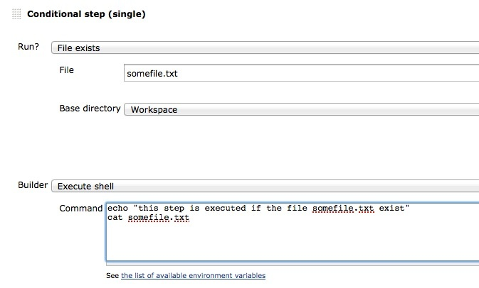
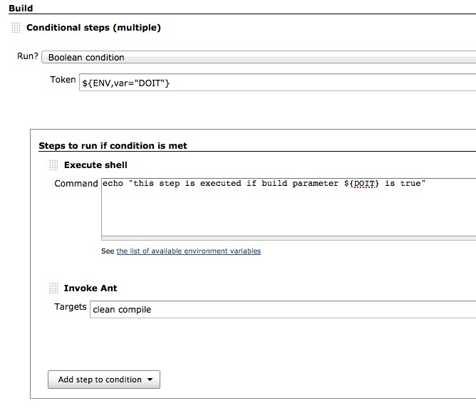

= Conditional Build Step Plugin for Jenkins

image:https://img.shields.io/jenkins/plugin/v/conditional-buildstep.svg[link="https://plugins.jenkins.io/conditional-buildstep"]
image:https://img.shields.io/github/release/jenkinsci/conditional-buildstep-plugin.svg?label=changelog[link="https://github.com/jenkinsci/conditional-buildstep-plugin/releases/latest"]
image:https://img.shields.io/jenkins/plugin/i/conditional-buildstep.svg?color=blue[link="https://plugins.jenkins.io/conditional-buildstep"]

A buildstep wrapping any number of other buildsteps, controlling their execution based on a defined condition.

== Info

This plugin requires the
https://plugins.jenkins.io/token-macro/[TokenMacro Plugin] and the 
https://plugins.jenkins.io/run-condition/[Run Condition Plugin] to be installed!

* Ever wanted to have more control whether a step should be executed or not?
* Want to reduce the number of jobs doing nearly the same thing?

Add a conditional buildstep which acts as a container.
It will allow you to define a condition controling the execution of the step(s).

== Conditions

There are multiple conditions one can choose of, these are all defined by the
https://plugins.jenkins.io/run-condition/[Run Condition Plugin]

Missing builder

If you're not able to add the builder of your choice within a
conditional build step (because it's not available within the dropdown),
then this is likely because the builder does not provide a
`@DataBoundConstructor` constructor and/or the Descriptor does not
extend `hudson.tasks.BuildStepDescriptor`.
For non programmers: the plugin you would like to use does not yet follow the newest Jenkins coding guidelines.
Without this, the conditional buildstep plugin is not able to work with it.

== Conditional step (single)

// TODO: Move https://wiki.jenkins-ci.org/pages/viewpage.action?pageId=59507542 to the documentation

This build step allows you to select any build step and define a
condition to control whether the step should be executed.

=== Freedom to re-order

As there is only one build step within the builder, they can all be re-ordered independantly - in the multiple step, they can only be re-ordered within that step.
This also gives the ability to add build steps in the middle of the current list of steps, where the new step may run on every build, or use a different condition from the steps surrounding it.
Obviously, the Conditional step (multiple) itself can be moved around.

=== Move a step from one condition to another

If you have several steps that are controlled by two conditions (via EnvInject), then you can easily swith the boolean condition for a single step to use the other condition.
With the multiple, all contained steps use the same condition, so again the step would have to be deleted and then added to the other conditional step.

=== Multiple steps can still be controlled by a single condition (EnvInject)

You can still run multiple build steps based on the result of a single evaluation of a run condition.
Configure a run condition and in the action choose 'Inject environment variables' provied by the EnvInject Plugin.
In the 'Properties Content' set a variable that will evaluate to true by the Boolean run condition e.g. `CONDITION_X=y`.
Now, for all the build steps that you want to run depending on that condition, use the Boolean run condition with `${ENV,var="CONDITION_X"}`.

=== Multiple steps can still be controlled by a single condition (EnvInject)

This still requires extra configuration, and even an extra build step.

=== GUI space

Many Conditional step (single) build steps will take up a very large area of the configure page which can make the configuration more difficult to read.

== Conditional steps (multiple)

A _Conditional steps (multiple)_ container is able to contain any number
of any other buildsteps (e.g. Shell, Ant, Maven,...) and you can have
any number of 'Conditional Steps' containers, each configured with a
different condition.

== Examples

Please check out the examples at the https://plugins.jenkins.io/run-condition/[Run Condition Plugin]

== Move steps inside conditional steps

To move all of the current build steps within a freestyle project into a conditional step (single) you can call a utility method from the script console.
The project build will not be affected in any way (other than some extra text in the build console), as the order of the build steps is preserved, and all of the run conditions will be 'Always'.
Build steps that cannot be moved into a conditional step will not be moved.

From Manage Jenkins, Script console, enter the following to update a project called 'My Project'

[source,groovy]
----
import static org.jenkinsci.plugins.conditionalbuildstep.singlestep.JobUpdater.*

def job = hudson.model.Hudson.instance.getItem('My Project')
updateBuilders job
----

After running, go to the configure page, check everything looks ok, then save the configuration.

You can now easily enable and disable the build steps without losing the configuration.

== Changelog

* For recent versions, see https://github.com/jenkinsci/conditional-buildstep-plugin/releases[GitHub Releases]
* For versions 1.3.6 and older, see the link:https://github.com/jenkinsci/conditional-buildstep-plugin/blob/master/CHANGELOG.adoc[legacy CHANGELOG].

== Reporting issues

Please report issues and enhancements through the link:Please report issues and enhancements through the [Jenkins issue tracker](https://www.jenkins.io/participate/report-issue/redirect/#15947)[Jenkins issue tracker].

== Getting Help

For help please use the https://community.jenkins.io[community forum], https://www.jenkins.io/mailing-lists/[Jenkins users mailing list], or link:https://www.jenkins.io/chat/[chat channels].

== License

// TODO: Add License File to the repo
Licensed under the https://opensource.org/licenses/MIT[MIT Licence].
